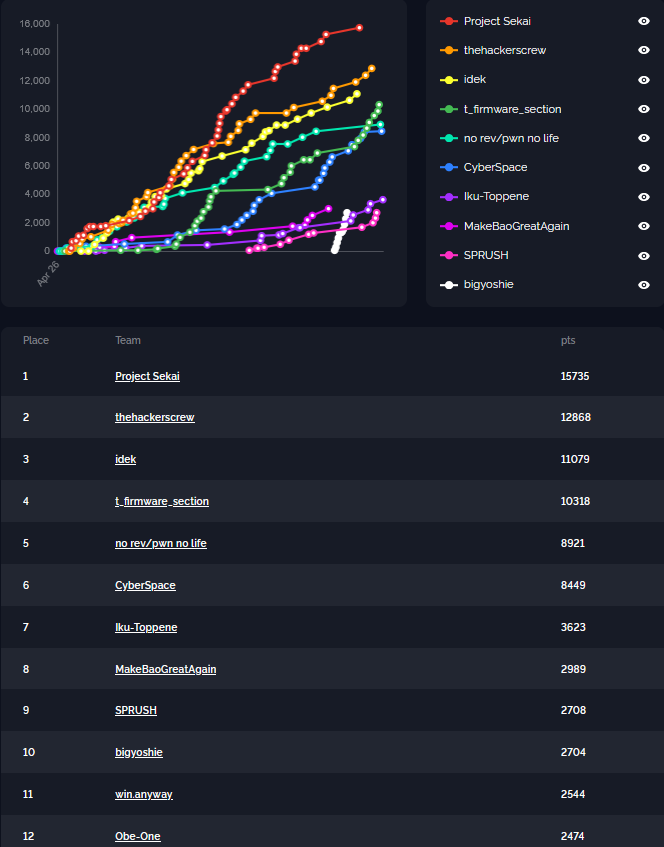

# cr3ctf-2024-dev

- Flag format: `cr3{.*}`
  - `cr3{test_flag}`
- Event duration: `36hrs`

This repository contains the source code for all the challenges, besides the scripts that were used for deploying and some other infrastructure-related things.

## Challenges

### Cryptography

| Name                | Author            | Wave |
|---------------------|-------------------|------|
| getting-closer-damn | r4sti             | 1    |
| maskRSA             | Onirique          | 1    | 
| guessing            | kibastian, es3n1n | 1    | 
| guessing-revenge    | kibastian, es3n1n | 2    | 
| pudge               | kibastian         | 2    |
| LCGo                | merabier          | 1    |
| dummy-aes           | Onirique          | 2    |
| embedding           | Onirique, Duha    | 1    |

### Misc

| Name                        | Author         | Wave |
|-----------------------------|----------------|------|
| sanitycheck                 |                | 1    |
| spurdo-ai                   | es3n1n         | 2    |
| wrong-flutter               | cpp.dog        | 2    |
| web-crypto                  | cpp.dog        | 1    |
| picklestar                  | j3seer, es3n1n | 1    |
| [blockchain] cr3proxy       | CarpeDiem      | 1    |
| [blockchain] cr3dao         | CarpeDiem      | 1    |
| [blockchain] cr3dao-revenge | CarpeDiem      | 2    |

### Forensics

| Name                 | Author            | Wave |
|----------------------|-------------------|------|
| donut                | dxq               | 2    |
| kennel               | 0xfedcafe         | 1    |
| behind-the-text      | dxq, Cherry       | 1    |

### Professional Programming and Coding

| Name             | Author                   | Wave |
|------------------| -------------------------|------|
| spurdanity-check | ATSTNG, es3n1n, cpp.dog  | 1    |
| spurdo-railways  | ATSTNG, es3n1n, cpp.dog  | 1    |
| spurdo-treasures | ATSTNG, es3n1n, cpp.dog  | 1    |
| spurdo-llc       | ATSTNG, es3n1n, cpp.dog  | 1    |
| spurdo-leveling  | ATSTNG, es3n1n, cpp.dog  | 1    |

### Binary exploitation

| Name               | Author        | Wave |
|--------------------|---------------|------|
| memo-service       | Lio           | 1    |
| number-warehouse   | Lio           | 2    |
| echo-chamber       | Lio           | 2    |
| randomness         | cocay         | 1    |
| randomness-revenge | brwook, cocay | 1    |
| packet-maker       | brwook        | 1    |
| mov-cr3            | brwook        | 1    |

### Reverse engineering

| Name            | Author | Wave |
|-----------------|--------|------|
| messed-calc     | es3n1n | 2    |
| warmup          | es3n1n | 1    |
| 15min-adventure | es3n1n | 2    |
| mbaboy          | es3n1n | 1    |
| 7elevm          | es3n1n | 1    |
| decrypt-me      | es3n1n | 1    |
| wonderful       | es3n1n | 2    |

### Web

| Name               | Author          | Wave |
|--------------------|-----------------|------|
| secretclub         | es3n1n, anger   | 2    |
| babylogin          | j3seer          | 1    |
| pp-size            | cpp.dog         | 2    |
| shippering         | es3n1n          | 1    |
| jscripting         | dxq, Cherry     | 1    |
| jscripting-revenge | dxq, Cherry     | 1    |
| spurdo-ebinling    | es3n1n, cpp.dog | 1    |

___

## Waves

### First

- +0h

### Second

- +18h
