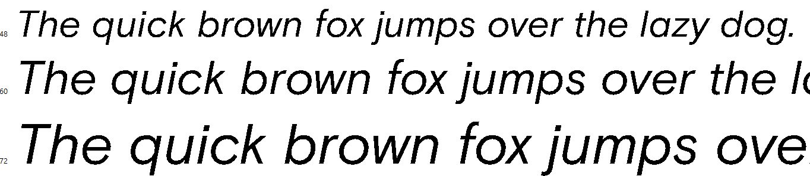

# Thoughts

Upon opening the font, the first thing we see is oddly sharp glyphs.



Immediately there is some thought that something is hidden inside the glyphs that makes them so sharp. Anyway, first we'll try to use the `strings` tool, maybe we can find something there?

It looks like a regular font, nothing unusual. Next, we'll try to view the font metadata using some tools, in my case I used the `otfinfo` and got this:


`Unique ID: cr3{dxq_beautiful_font_2024}` whic is a fake flag, we'll skip this line.

But this line `Description: this is the least significant information, try looking a bit deeper :)` is more interesting and it tells us to look a **bit** deeper. Probably the `least significant information` tells us about some LSB patterns inside of the font itself. 

Also, one more notable thing is `Vendor ID: 0xE`. If compare it to other fonts we'll see that the value always matches with `^[A-F]{1,4}$`. It's most likely some kind of offset or length.

Let's dive in and look at the structure of the glyphs. As we can see that the letter `A` is completely broken and something is obviously wrong with the coordinates `x`, `y`:


So, it looks like the glyph contours are modified, which seems like LSB, let's take a look at glyphs and iterate over each `x` and `y` points. In my case, I used the [fonttools](https://github.com/fonttools/fonttools) library to look at the contours of the font and got this:

```xml
<TTGlyph name="A" xMin="0" yMin="0" xMax="15153" yMax="12075">
    <contour>
        <pt x="0" y="5132" on="1"/>
        <pt x="7057" y="9974" on="1"/>
        <pt x="13336" y="11244" on="1"/>
        <pt x="13201" y="8410" on="1"/>
        <pt x="12214" y="12075" on="1"/>
        <pt x="15153" y="8412" on="1"/>
        <pt x="14910" y="207" on="1"/>
        <pt x="39" y="0" on="1"/>
        </contour>
        <contour>
        <pt x="359" y="549" on="1"/>
        <pt x="200" y="277" on="1"/>
        <pt x="454" y="277" on="1"/>
        <pt x="401" y="549" on="1"/>
        <pt x="397" y="570" on="1"/>
        <pt x="393" y="587" on="0"/>
        <pt x="391" y="607" on="1"/>
        <pt x="387" y="601" on="0"/>
        <pt x="374" y="575" on="0"/>
        <pt x="371" y="570" on="1"/>
    </contour>
    <instructions/>
</TTGlyph>
```

As seen in the previous screenshot, the coordinates of the letter `A` are broken, we can assume that `Vendor ID: 0xE` is the bit length value which makes the numbers so weird. So, let's start cooking the solver.

# Solution

```py
import xml.etree.ElementTree as ET
from fontTools.ttLib import TTFont

font = TTFont('font.ttf')

font.saveXML('temp.xml')
font_xml_tree = ET.parse('temp.xml')

def b2s(s):
    return ''.join(chr(int(s[i * 8 : i * 8 + 8], 2)) for i in range(len(s) // 8))

def read_lsb(pt, bit_length):
    x = format(int(pt.get('x')), 'b').zfill(bit_length + 1)
    y = format(int(pt.get('y')), 'b').zfill(bit_length + 1)

    return x[-bit_length:] + y[-bit_length:]

def decrypt(data_length, bit_length):
    iterator = font_xml_tree.iter(tag = 'pt')

    data = ''
    while len(data) < data_length:
        data += read_lsb(next(iterator), bit_length)

    length = int(data[:data_length], 2)
    output = data[data_length:]

    while len(output) < length:
        output += read_lsb(next(iterator), bit_length)

    return output[:length]


BIT_LENGTH = 0xE
flag = ''
size = 0

while 'cr3' not in flag:
    size += 1
    data = decrypt(size, BIT_LENGTH)

    if len(data) > 0:
        flag = b2s(data)

print(flag)
```

And booooom the output is: `cr3{h1_fr0m_my_f0nt|` it's a bit corrupted but easy to guess.

Final flag: `cr3{h1_fr0m_my_f0nt}`