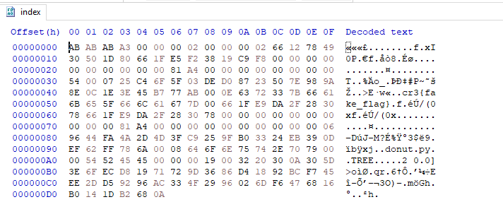

# Overview

We have a folder that contains only two files:

**README.md** and **donut.py** (content of these files is basically the same)
```py
               ) or (B := 0) or print((                           
            "\x1b[2J")) or not ((sin := ((                        
         __import__('math'))).sin)) or not (                     
      cos := __import__('math').cos) or (o_ := (                   
     True)): [pr() for b in [[(func(), b) for ((z                 
    )) in [[0 for _ in range(1760)]] for b in [[ (                
   "\n") if ii % 80 == 79 else " " for ii in range(               
  1760)]] for o, D, N in [(o, D, N) for j in range((              
 0), 628, 7) for i in range(0, 628, 2) for (c, d, e,(             
f), g, l, m, n) in [(sin(     i / 100), cos(j / 100),(             
sin(A)), sin(j / 100),          cos(A), cos(i / 100) ,            
cos(B), sin(B))] for              (h) in [d + 2] for (            
D, t) in [ (1 / ( c               * h * e + f * g + (5
)), c * h * g - f *                e)] for (x, y) in [            
(int( 40 + 30 * D * (              l * h * m - t * n)),            
int( 12 + 15 * D * ( l           * h * n + t * (m))))]            
 for (o, N) in [(x + 80 *     y,int(8 * (( f * e -  c              
  * d * g) * m - c * d * e - f * g - l * d * n)))] if             
  0 < x < 80 and 22 > y > 0] if D > z[o] for func in              
   [lambda: (z.pop((o))), lambda: z.insert((o), (D)                
    ),(lambda: (b.pop( o))), lambda: b.insert((o),                 
     ".,-~:;=!*#$@"[ N if N > 0 else 0])]][ 0][1]                 
       ] for pr in [lambda: print("\x1b[H"),                    
         lambda: print("".join(b))] if (A :=
            A + 0.02) and ( B := B + 0.02)]          
```

After reviewing these files, we find nothing of interest to us, but wait... there is an initialized Git repository. 
Let's take a look at it, probably we could find something inside.

Firstly, we would try to use `git status` and get an error:

```
error: bad signature 0xa3ababab
fatal: index file corrupt
```

Huh.. it seems like `index` file is corrupted, then we should try to use some commands that could help us:

`git log` - trying to get some logs about the current branch
```
fatal: your current branch 'master' does not have any commits yet
```

`git branch -a` - literally gives up nothing, seems like there are no accessible branches

`git checkout test` - trying to checkout somewhere
```
error: bad signature 0xa3ababab
fatal: index file corrupt
```

`git fsck --verbose --lost-found` - [fsck](https://git-scm.com/docs/git-fsck) is git repair tool that could search for lost commits, 
but for us it doesn't seem interesting, there are just some useless commits

```
Checking object directory
Checking blob 18647d6429b7814c03fb3cf1015adbd73c4ab23f
Checking commit 2a461812df0b80851da28cf6e69f3a2d84129b01
Checking tree 3e99af25da2bfd1afa8adf7e576f059d25e97dd0
Checking commit e1cf8e13bfe7f2b9522642a878368677621349b1
Checking blob e0b3e4b7203ed7e3b47cc34b403a93c742c2843d
Checking blob ea0ff988ee62eff9f11d4d6c33c603eac0734256
Checking tree ec6c144a0727e73902b4ce7da60b91d173cead3e
Checking HEAD link
notice: HEAD points to an unborn branch (master)
notice: No default references
error: bad signature 0xa3ababab
fatal: index file corrupt

and a lot of such strings
...
bad sha1 file: .git/objects/{id}/{hash}
...
```

# Thoughts

So, now we have a lot of information about this challenge. 
We have a Git repository that has a broken `index` file,
we can look at it in any hex editor, i'll use [HxD](https://mh-nexus.de/en/hxd/).



We can see that some chunks are corrupted, and it seems like we have to rebuild them.

# Understanding the Index file

Here's a quick overview of what info an index file contains:

1. A 12-byte header.
2. A number of sorted index entries.
3. Extensions. They are identified by signature.
4. 160-bit SHA-1 over the content of the index file before this checksum.

## Header

Corrupted header

```
AB AB AB A3 00 00 00 02 00 00 00 02
```

Originally, the index file starts with a 12-byte header:

```
44 49 52 43 00 00 00 02 00 00 00 02
```

A 12-byte header consisting of a 4-byte signature “DIRC” (0x44495243) standing for DirCache; 4-byte version number “2” (0x00000002), which is the current version of Git index format; 32-bit number of index entries “2” (0x00000002).


## Index Entry

In the entry, we have some stats about the files from this repository:

### 64-bit ctime

32-bit ctime seconds, the last time a file’s metadata changed; and 32-bit ctime nanosecond fractions.
According to the HFS+ volume format spec, it only stores timestamps to a granularity of one second.
In other words, the nanosecond fractions are unused.

So we have two files there.

A file named cr3{fake_flag}

```
66 12 78 49 30 50 1D 80
```

“2024-04-07T10:41:13” (0x66127849)

And a file donut.py

```
66 1F E9 DA 2F 28 30 78
```

“2024-04-17T3:25:14” (0x661FE9DA)

### 64-bit mtime

The binary layout of this data structure is basically the same as ctime.

cr3{fake_flag}:

```
66 1F E5 F2 38 19 C9 F8
```

“2024-04-17T3:08:34” (0x661FE5F2).

donut.py:

```
66 1F E9 DA 2F 28 30 78
```

“2024-04-17T3:25:14” (0x661FE9DA)

### 32-bit dev

For both of files, the value will be:

```
00 00 00 00
```

The device (0) upon which file resides.

### 32-bit ino

For both of files, the value will be:

```
00 00 00 00
```

The file inode number (0). The overflowed part seems to be truncated.

### 32-bit mode

For both of files, the value will be:

```
00 00 81 a4
```

The hexadecimal representation of file permission 100644 (octal).

### 32-bit uid

For both of files, the value will be:

```
00 00 00 00
```

The user identifier of the current user (0).

You can check your identifier with the following command:

```bash
id -u
```

### 32-bit gid

```
00 00 00 00
```

You can check your identifier with the following command:

```bash
id -g
```

The group identifier of the current user.

### 32-bit file size

cr3{fake_flag}:

```
54 00 07 25
```

1409287973 bytes (0x54000725)

donut.py:

```
00 00 06 96
```

1686 bytes (0x00000696)

### 160-bit SHA-1 Object ID

A 20-byte (160-bit) SHA-1 over the content of the index file before this checksum.

cr3{fake_flag}

```
C4 6F 5F 03 DE D0 87 23 50 7E 98 9A 8E 0C 1E 3E 45 B7 77 AB
```

donut.py

```
44 FA 4A 2D 4D 3F C9 25 9F B0 33 24 EB 39 0D EF 62 FF 78 6A
```

### A 16-bit ‘flags’ field split into (high to low bits)

1-bit assume-valid flag (false); 1-bit extended flag (must be zero in version 2); 2-bit stage (during merge); The value is 0.

cr3{fake_flag}:

```
00
```

donut.py:

```
00
```

### File Path (length + null terminator)

The index entry path name relative to top level directory (without leading slash).
12-bit name length if the length is less than 0xFFF, otherwise 0xFFF is stored in this field.

Plus one NULL byte is to pad the entry to a multiple of eight bytes while keeping the name NULL-terminated.
In our case, the index entry starts with 64-bit ctime.

cr3{fake_flag}:

```
0E
```

**cr3{fake_flag}** + **\0** = 0xE = 14

donut.py:

```
09
```

**donut.py** + **\0** = 0x9 = 9

File chunk:

```
AB AB AB A3 00 00 00 02 00 00 00 02 66 12 78 49 
30 50 1D 80 66 1F E5 F2 38 19 C9 F8 00 00 00 00 
00 00 00 00 00 00 81 A4 00 00 00 00 00 00 00 00 
54 00 07 25 C4 6F 5F 03 DE D0 87 23 50 7E 98 9A 
8E 0C 1E 3E 45 B7 77 AB 00 0E 63 72 33 7B 66 61 
6B 65 5F 66 6C 61 67 7D
```

## Extensions

Empty here

## SHA-1 Index Checksum

cr3{fake_flag}:

```
C4 6F 5F 03 DE D0 87 23 50 7E 98 9A 8E 0C 1E 3E 45 B7 77 AB
```

donut.py:

```
44 FA 4A 2D 4D 3F C9 25 9F B0 33 24 EB 39 0D EF 62 FF 78 6A
```

160-bit SHA-1 over the content of the index file before this checksum. If the index is corrupted, you might meet an error like “index file corrupt”:

```
error: bad index file sha1 signature
fatal: index file corrupt
```

# Solution

After we've completely disassembled the small parts of the index file, we can see that some parts aren't correct.

These parts will be:

## Rebuilding Index

### Header signagture

~~`AB AB AB A3 00 00 00 02 00 00 00 02`~~ -> `44 49 52 43 00 00 00 02 00 00 00 02`

### Restore README.md

Here we're just renaming cr3{fake_flag} into README.md and fix the length:

~~`00 0E 63 72 33 7B 66 61 6B 65 5F 66 6C 61 67 7D 00`~~ -> `00 0A 52 45 41 44 4D 45 2E 4D 44 00`

### File sizes

README.md

~~`54 00 07 25`~~ -> `00 00 07 25`


donut.py

~~`00 00 06 96`~~ -> `00 00 06 9A`


### File 160-bit SHA-1s

Here you can use the `git hash-object <filename>` command.

README.md
~~`C4 6F 5F 03 DE D0 87 23 50 7E 98 9A 8E 0C 1E 3E 45 B7 77 AB`~~ -> `EA 0F F9 88 EE 62 EF F9 F1 1D 4D 6C 33 C6 03 EA C0 73 42 56`

donut.py
~~`44 FA 4A 2D 4D 3F C9 25 9F B0 33 24 EB 39 0D EF 62 FF 78 6A`~~ -> `E0 B3 E4 B7 20 3E D7 E3 B4 7C C3 4B 40 3A 93 C7 42 C2 84 3D`

## Valid Index

Now we will trying to use `git fsck --verbose --lost-found` again and get following results:

```
Checking object directory
Checking blob 18647d6429b7814c03fb3cf1015adbd73c4ab23f
Checking commit 2a461812df0b80851da28cf6e69f3a2d84129b01
Checking tree 3e99af25da2bfd1afa8adf7e576f059d25e97dd0
Checking commit e1cf8e13bfe7f2b9522642a878368677621349b1
Checking blob e0b3e4b7203ed7e3b47cc34b403a93c742c2843d
Checking blob ea0ff988ee62eff9f11d4d6c33c603eac0734256
Checking tree ec6c144a0727e73902b4ce7da60b91d173cead3e
Checking HEAD link
notice: HEAD points to an unborn branch (master)
notice: No default references
Checking connectivity (32 objects)
Checking e0b3e4b7203ed7e3b47cc34b403a93c742c2843d
Checking e1cf8e13bfe7f2b9522642a878368677621349b1
Checking ea0ff988ee62eff9f11d4d6c33c603eac0734256
Checking 2a461812df0b80851da28cf6e69f3a2d84129b01
dangling commit 2a461812df0b80851da28cf6e69f3a2d84129b01
Checking ec6c144a0727e73902b4ce7da60b91d173cead3e
Checking b47cc34b403a93c742c2843d0008646f6e75742e
missing blob b47cc34b403a93c742c2843d0008646f6e75742e
Checking 18647d6429b7814c03fb3cf1015adbd73c4ab23f
Checking 3e99af25da2bfd1afa8adf7e576f059d25e97dd0

and a lot of these strings
...
bad sha1 file: .git/objects/{id}/{hash}
...
```

There is one dangling commit result with the following hash:

```
dangling commit 2a461812df0b80851da28cf6e69f3a2d84129b01
```

Let's take a look at what's inside with `git show 2a461812df0b80851da28cf6e69f3a2d84129b01`

```
commit 2a461812df0b80851da28cf6e69f3a2d84129b01

    added flag

diff --git a/flag b/flag
new file mode 100644
index 0000000..18647d6
--- /dev/null
+++ b/flag
@@ -0,0 +1 @@
+cr3{w3_4r3_411_10v3_d0n7T5!1}
```

`cr3{w3_4r3_411_10v3_d0n7T5!1}`
