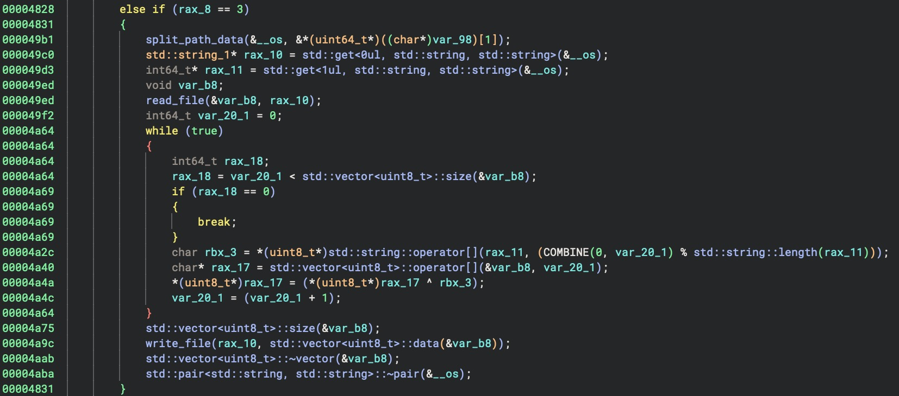

# writeup

If we start with guessing, the challenge name is kennel, so you **probably** have to look for something with dogs. 
In Pictures directory we see .taksa.png, also our VM is called 156.ova, that hints us about LSB, but of course it doesn't really mean anything. 

After browsing directories you will find some png files in the unusual folders: `charlie.png`, `taksa.png`, `cooper.png`. 

```bash
/usr/local/share/nothing_to_share/charlie.png
/usr/local/games/local_games/cooper.png
/usr/include/dont_include/my_dog.png
/home/chloe/Pictures/.taksa.png
```

After digging some more for unusual stuff you would probably find `/usr/games/nothinghered`.

If you open it in decompiler you will see this:


This is a packing process of a beacon


And here's the unpacking process

Also you can see "taksa.png" in strings of binary, and code, which means that it's a base image that was used for encoding and should be used for decoding.

We can see that it's a basic LSB stego, where green and red colors are used.
To solve the challenge you can extract payloads, check how these are executed in executer_t and you will receive a flag.
`taksa.png` is a base image, that was used for encoding a data on other pictures with xor.

If we extract the beacons from these images, we can see that
- First one creates a file within the `/tmp` directory, called `heh.txt`
- Second one writes there some data
- And third, the last one is xoring it with some key





Here you can see an execution of a payload.

```cpp
beacon_t::beacon_t(const std::string& path) {
  Magick::Image beacon(path);
  Magick::Image base_image(kBaseImagePath);
  unsigned char packed_data[33] = {0};

  if (beacon.columns() != base_image.columns() ||
      beacon.rows() != base_image.rows())
    throw std::length_error("Wrong filesize");
  for (ssize_t x = 0; x < 132; x += 4) {
    for (ssize_t i = 0; i < 4; i++) {
      auto mcolor = beacon.pixelColor(x + i, 0);
      auto bcolor = base_image.pixelColor(x + i, 0);  // later will be y prolly

      auto mr = static_cast<std::uint16_t>(mcolor.redQuantum());
      auto br = static_cast<std::uint16_t>(bcolor.redQuantum());

      auto mg = static_cast<std::uint16_t>(mcolor.greenQuantum());
      auto bg = static_cast<std::uint16_t>(bcolor.greenQuantum());

      std::int32_t data_red = (mr ^ br) & 1;
      std::int32_t data_green = (mg ^ bg) & 1;

      // don't care, actually it's a bool
      packed_data[x / 4] =
          ((packed_data[x / 4] << 2) | (data_red << 1) | data_green);
    }
  }

  type = packed_data[0];
  std::memcpy(text_data, packed_data + 1, 32);
}
```
This one is an ImageMagick6 solution, instead you can use quantumRed, qunatumGreen, quantumBlue methods to make it work with ImageMagick7.

Here is the Python implementation:

```python
import cv2 as cv

base_path = "taksa.png"

def xor_strings(str1, str2):
    result = ""
    for char1, char2 in zip(str1, str2):
        xor_result = ord(char1) ^ ord(char2)  # XOR the ASCII codes of characters
        result += chr(xor_result)  # Convert the result back to a character
    return result

def extract_data(src, data_pixels):
    # if you check exiftool, you will see that an image uses color type RGB
    # and bit depth is 16, by default opencv converts it into 8 bit picture, 
    # so we have to specify IMREAD_ANYEDEPTH + ANYCOLOR, otherwise you will 
    # get rounded colors and won't get needed data with xor 

    base_img = cv.imread(base_path, cv.IMREAD_ANYDEPTH | cv.IMREAD_ANYCOLOR)
    bwidth, bheight, bchannels = base_img.shape

    data_img = cv.imread(src, cv.IMREAD_ANYDEPTH | cv.IMREAD_ANYCOLOR)
    dwidth, dheight, dchannels = data_img.shape

    if dwidth != bwidth or dheight != bheight or dchannels != bchannels:
        raise ValueError("Image dimensions mismatch")

    # hehe-haha, it's RGB but 2 bytes per color
    bytes = data_pixels // 4
    decrypted_data = [0] * bytes

    # the data is in BGR format, because we used cv.imread
    for x in range(0, data_pixels, 4):
        enc_data = 0
        for b in range(0, 4):
            _, bg, br = base_img[0][x + b]
            _, dg, dr = data_img[0][x + b]

            data_red = (br ^ dr) & 1
            data_green = (bg ^ dg) & 1

            enc_data = (enc_data << 2) | (data_red << 1) | (data_green)
        decrypted_data[x // 4] = enc_data

    return (''.join(map(chr, decrypted_data)))

# we don,t care about first beacon, it's just a file creation
b1 = extract_data("charlie.png", 132)
b2 = extract_data("my_dog.png", 132)
b3 = extract_data("cooper.png", 132)

txt = b2.split('|')[1]
key = b3.split('|')[1]

print(xor_strings(txt, key))
```
