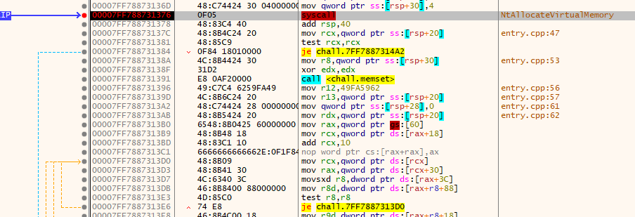
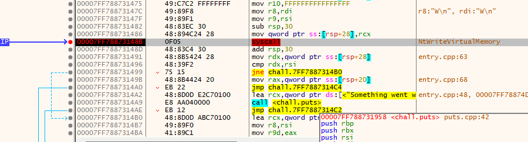
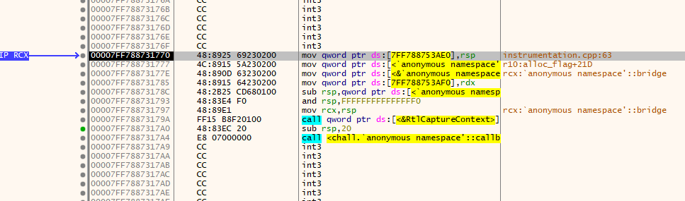

Once we open the challenge file in IDA we can see the following main function
```cpp
int __cdecl main(int argc, const char **argv, const char **envp)
{
  unsigned __int64 v3; // rsi
  FILE *v4; // rax
  __int64 v6; // rax
  char *v7; // rax
  __int64 v8; // rdx
  __int64 v9; // rax
  char v10; // al
  const char *v11; // rcx
  char v12[56]; // [rsp+20h] [rbp-48h] BYREF

  puts("Welcome to my little flag checker, please enter your flag");
  v3 = 0i64;
  v4 = _acrt_iob_func(0);
  sub_140003DC8(v12, 47i64, v4);
  while ( v12[v3] != 10 && v12[v3] )
    ++v3;
  if ( v3 )
  {
    if ( v3 >= 4 )
    {
      v6 = 0i64;
      do
      {
        v12[v6] ^= 0x66u;
        v12[v6 + 1] ^= 0x66u;
        v12[v6 + 2] ^= 0x66u;
        v12[v6 + 3] ^= 0x66u;
        v6 += 4i64;
      }
      while ( (v3 & 0xFFFFFFFFFFFFFFFCui64) != v6 );
    }
    else
    {
      v6 = 0i64;
    }
    if ( (v3 & 3) != 0 )
    {
      v7 = &v12[v6];
      v8 = 0i64;
      do
        v7[v8++] ^= 0x66u;
      while ( (v3 & 3) != v8 );
    }
    v9 = sub_140001210(v12, v3);
    v10 = sub_140001050(v9, v3);
    v11 = "Incorrect!";
    if ( v10 )
      v11 = "Correct!";
    puts(v11);
    exit(0);
  }
  puts("You didn't enter your flag, didn't you?");
  return 1;
}
```

If we jump into the `sub_140001270` we can't really see anything useful in the pseudocode, so we'll hop to the x64dbg and see what's up
```cpp
__int64 sub_140001270()
{
  struct _LIST_ENTRY *p_InLoadOrderModuleList; // rcx
  struct _LIST_ENTRY *Flink; // rax
  __int64 v2; // rdx
  int v3; // r8d
  __int64 v4; // rbx
  char v5; // bp
  char *v6; // rbx
  int v7; // r14d

  p_InLoadOrderModuleList = &NtCurrentPeb()->Ldr->InLoadOrderModuleList;
  do
  {
    do
    {
LABEL_2:
      p_InLoadOrderModuleList = p_InLoadOrderModuleList->Flink;
      Flink = p_InLoadOrderModuleList[3].Flink;
      v2 = *(unsigned int *)((char *)&Flink[8].Blink + SHIDWORD(Flink[3].Blink));
    }
    while ( !*(_DWORD *)((char *)&Flink[8].Blink + SHIDWORD(Flink[3].Blink)) );
    v3 = *(_DWORD *)((char *)&Flink[1].Blink + v2);
  }
  while ( !v3 );
  while ( 1 )
  {
    v4 = *(unsigned int *)((char *)&Flink->Flink + 4 * --v3 + *(unsigned int *)((char *)&Flink[2].Flink + v2));
    v5 = *((_BYTE *)&Flink->Flink + v4);
    if ( v5 )
    {
      v6 = (char *)&Flink->Flink + v4 + 1;
      v7 = -1554079227;
      do
      {
        v7 = 16777619 * (v7 ^ v5);
        v5 = *v6++;
      }
      while ( v5 );
      if ( v7 == 1717562040 )
        break;
    }
    if ( !v3 )
      goto LABEL_2;
  }
  __asm { syscall; Low latency system call }
  puts("Something went wrong... (1)\n");
  return 0i64;
}
```
What we're interested in is the syscalls, so that's why we just BP the syscall instruction and see what syscall it's calling




NtAllocateVirtualMemory and NtWriteVirtualMemory? Looks legit, by tracing the registers that are passed to these syscalls we can deduce that what it's doing, is allocating the space for the flag and copying the flag content(encrypted via xor 0x66) to this newly allocated region. All the next operations would be processing the xored flag

Following the next function from main `sub_140001050`
```cpp
__int64 __fastcall sub_140001050(__int64 a1, unsigned __int64 a2)
{
  unsigned int v2; // esi
  __int64 v3; // r8
  __int64 v4; // r9
  char *v5; // r8
  __int64 v6; // r10
  unsigned __int64 v7; // rax
  __int64 v8; // r8
  unsigned __int64 v9; // rdx
  char *v10; // rdx
  __int64 v11; // rcx
  __int64 i; // r8
  __int64 v14; // [rsp+20h] [rbp-38h] BYREF
  __int64 v15; // [rsp+28h] [rbp-30h]
  __int64 v16; // [rsp+30h] [rbp-28h]
  __int64 v17; // [rsp+38h] [rbp-20h]
  int v18; // [rsp+40h] [rbp-18h]
  __int16 v19; // [rsp+44h] [rbp-14h]

  v19 = -19977;
  v18 = 474495962;
  v17 = 0x7162456D69F3005i64;
  v16 = 0x36161B6C3DFBB437i64;
  v15 = 0xF3BFF9C2BC24994Fui64;
  v14 = 0xC5EFD8928EEF23ACui64;
  if ( a2 )
  {
    if ( a2 >= 4 )
    {
      v3 = 0i64;
      do
      {
        *(_BYTE *)(a1 + v3) ^= *((_BYTE *)&v14 + v3);
        *(_BYTE *)(a1 + v3 + 1) ^= *((_BYTE *)&v14 + v3 + 1);
        *(_BYTE *)(a1 + v3 + 2) ^= *((_BYTE *)&v14 + v3 + 2);
        *(_BYTE *)(a1 + v3 + 3) ^= *((_BYTE *)&v14 + v3 + 3);
        v3 += 4i64;
      }
      while ( (a2 & 0xFFFFFFFFFFFFFFFCui64) != v3 );
    }
    else
    {
      v3 = 0i64;
    }
    if ( (a2 & 3) != 0 )
    {
      v4 = a1 + v3;
      v5 = (char *)&v14 + v3;
      v6 = 0i64;
      do
      {
        *(_BYTE *)(v4 + v6) ^= v5[v6];
        ++v6;
      }
      while ( (a2 & 3) != v6 );
    }
    LOBYTE(v2) = a2 == 38;
    v19 = -21770;
    v18 = 457325539;
    v17 = 0x41B2356EFCA3E17i64;
    v16 = 0xF17133B3FF3E337i64;
    v15 = 0xCAB7AFFBEF36CB5Bui64;
    v14 = 0xC4E78E9793BA37A9ui64;
    v7 = a2 & 3;
    if ( a2 >= 4 )
    {
      v9 = a2 & 0xFFFFFFFFFFFFFFFCui64;
      v8 = 0i64;
      do
      {
        LOBYTE(v2) = v2 & (*(_BYTE *)(a1 + v8) == *((_BYTE *)&v14 + v8)) & (*(_BYTE *)(a1 + v8 + 1) == *((_BYTE *)&v14 + v8 + 1)
                                                                         && *(_BYTE *)(a1 + v8 + 2) == *((_BYTE *)&v14 + v8 + 2)) & (*(_BYTE *)(a1 + v8 + 3) == *((_BYTE *)&v14 + v8 + 3));
        v8 += 4i64;
      }
      while ( v9 != v8 );
    }
    else
    {
      v8 = 0i64;
    }
    if ( v7 )
    {
      v10 = (char *)&v14 + v8;
      v11 = v8 + a1;
      for ( i = 0i64; i != v7; ++i )
        LOBYTE(v2) = (*(_BYTE *)(v11 + i) == (unsigned __int8)v10[i]) & v2;
    }
  }
  else
  {
    v19 = -21770;
    v18 = 457325539;
    v17 = 0x41B2356EFCA3E17i64;
    v16 = 0xF17133B3FF3E337i64;
    v15 = 0xCAB7AFFBEF36CB5Bui64;
    v14 = 0xC4E78E9793BA37A9ui64;
    v2 = 0;
  }
  LOBYTE(v2) = v2 & 1;
  return v2;
}
```
Looks odd, by placing a BP on the xor operations we can see that it's xoring the flag content with some static key byte by byte(each unique key for each byte), then it takes a second array of bytes and compares whether the produced array matches some other static array. If so, it returns true, otherwise it returns false. Knowing that the main function prints the message `Correct` or `Incorrect` based on the result of this function we can clearly tell that it checks the flag.

Looks easy, we hop onto the z3 solver and try to find a sat for such a flag(or we can just dexor it using the key, but I'll do it with z3 because we'll need it anyway for some next steps).

```python
from z3 import *


s = Solver()
keys = [
0xac,0x23,0xef,0x8e,0x92,0xd8,0xef,0xc5,0x4f,0x99,0x24,0xbc,0xc2,0xf9,0xbf,0xf3,0x37,0xb4,0xfb,0x3d,0x6c,0x1b,0x16,0x36,0x5,0x30,0x9f,0xd6,0x56,0x24,0x16,0x7,0xda,0x3b,0x48,0x1c,0xf7,0xb1
]
encrypted = [
0xa9,0x37,0xba,0x93,0x97,0x8e,0xe7,0xc4,0x5b,0xcb,0x36,0xef,0xfb,0xaf,0xb7,0xca,0x37,0xe3,0xf3,0x3f,0x3b,0x13,0x17,0xf,0x17,0x3e,0xca,0xef,0x56,0x23,0x1b,0x4,0xe3,0x3b,0x42,0x1b,0xf6,0xaa
]
FLAG = [BitVec(f'FLAG_{i}', 8) for i in range(len(keys))]


for i in range(len(FLAG)):
    s.add((FLAG[i] ^ 0x66) >= 33)
    s.add((FLAG[i] ^ 0x66) <= 127)


for i in range(len(keys)):
    s.add(FLAG[i] ^ keys[i] == encrypted[i])


s.check()
model = s.model()

for x in FLAG:
    print(chr(model[x].as_long() ^ 0x66), end='')
print()
```
And it produced the string `cr3{c0ngr4t5_0n_f1nd1ng_th3_fake_flag}`
As you may already have guessed this is a fake flag and we are looking for some other flags
By tracing the program execution we can catch that once we enter the syscall instruction it redirects to some other stub



We open this stub in ida and we can see that its saving some registers to the `.data` section, captures the execution context via `RtlCaptureContext` and invokes some other function.
```cpp
void __fastcall __noreturn sub_140001770(__int64 a1, __int64 a2)
{
  __int64 v2; // r10
  void *retaddr; // [rsp+0h] [rbp+0h] BYREF

  qword_140023AE0 = (__int64)&retaddr;
  qword_140023AD8 = v2;
  qword_140023AE8 = a1;
  qword_140023AF0 = a2;
  RtlCaptureContext((PCONTEXT)&retaddr);
  sub_1400017B0();
  JUMPOUT(0x1400017A9i64);
}
```
Once we open the `sub_1400017B0` in the IDA we can see that it checks some chars, re-encrypts something, restores the execution context and exits
```cpp
void __fastcall sub_1400017B0(struct _CONTEXT *a1)
{
  char *R13; // rax
  int v3; // ecx
  char v4; // dl
  __int64 v5; // rcx
  __int64 v6[4]; // [rsp+30h] [rbp-38h]
  int v7; // [rsp+50h] [rbp-18h]
  __int16 v8; // [rsp+54h] [rbp-14h]

  a1->Rip = qword_140023AD8;
  a1->Rsp = qword_140023AE0;
  a1->Rcx = qword_140023AE8;
  if ( a1->R12 == 1241143650 )
  {
    R13 = (char *)a1->R13;
    if ( R13 )
    {
      if ( *R13 == 5 && R13[1] == 20 && R13[2] == 85 && R13[3] == 29 )
      {
        v3 = (unsigned __int8)R13[4];
        if ( v3 == 0x12 || v3 == 5 )
        {
          v8 = -11448;
          v7 = -1836494567;
          v6[3] = 0xC7EAB4322C5C7F7Eui64;
          v6[2] = 0x33EAF1E46E35ECF2i64;
          v6[1] = 0x4F47D6FC1CE792Ci64;
          v6[0] = 0x3E08C15356000F44i64;
          v4 = *R13;
          if ( *R13 )
          {
            v5 = 0i64;
            do
            {
              R13[v5] = __ROL1__((v5 + *((_BYTE *)v6 + v5)) ^ v5 ^ v4, 2);
              v4 = R13[++v5];
            }
            while ( v4 );
          }
        }
      }
    }
  }
  RtlRestoreContext(a1, 0i64);
}
```
If we try to dexor these bytes that it checks for with the key 0x66 we can see that it checks for the flag start
```python
In [1]: chr(5 ^ 0x66)
Out[1]: 'c'

In [2]: chr(20 ^ 0x66)
Out[2]: 'r'

In [3]: chr(85 ^ 0x66)
Out[3]: '3'

In [4]: chr(29 ^ 0x66)
Out[4]: '{'

In [5]: chr(0x12 ^ 0x66)
Out[5]: 't'

In [6]: chr(0x5 ^ 0x66)
Out[6]: 'c'

In [7]:
```
And after a bit of modification of the z3 solver, we can finally find the flag
```python
from z3 import *


s = Solver()
keys2 = [
0x44,0xf,0x0,0x56,0x53,0xc1,0x8,0x3e,0x2c,0x79,0xce,0xc1,0x6f,0x7d,0xf4,0x4,0xf2,0xec,0x35,0x6e,0xe4,0xf1,0xea,0x33,0x7e,0x7f,0x5c,0x2c,0x32,0xb4,0xea,0xc7,0x19,0x51,0x89,0x92,0x48,0xd3
]
keys = [
0xac,0x23,0xef,0x8e,0x92,0xd8,0xef,0xc5,0x4f,0x99,0x24,0xbc,0xc2,0xf9,0xbf,0xf3,0x37,0xb4,0xfb,0x3d,0x6c,0x1b,0x16,0x36,0x5,0x30,0x9f,0xd6,0x56,0x24,0x16,0x7,0xda,0x3b,0x48,0x1c,0xf7,0xb1
]
encrypted = [
0xa9,0x37,0xba,0x93,0x97,0x8e,0xe7,0xc4,0x5b,0xcb,0x36,0xef,0xfb,0xaf,0xb7,0xca,0x37,0xe3,0xf3,0x3f,0x3b,0x13,0x17,0xf,0x17,0x3e,0xca,0xef,0x56,0x23,0x1b,0x4,0xe3,0x3b,0x42,0x1b,0xf6,0xaa
]
FLAG_st = [BitVec(f'FLAG2_{i}', 8) for i in range(len(keys))]
FLAG = [BitVec(f'FLAG_{i}', 8) for i in range(len(keys))]


for i in range(len(FLAG)):
    s.add((FLAG[i] ^ 0x66) >= 33)
    s.add((FLAG[i] ^ 0x66) <= 127)


for i in range(len(keys2)):
    s.add(FLAG_st[i] == RotateLeft(FLAG[i] ^ (keys2[i] + i) ^ i, 2))


for i in range(len(keys)):
    s.add(FLAG_st[i] ^ keys[i] == encrypted[i])


s.check()
model = s.model()

for x in FLAG:
    print(chr(model[x].as_long() ^ 0x66), end='')
print()
```
(which finally printed `cr3{t0ld_y0u_th4t_1t_w0uld_t4k3_15m1n}`)

(if you are interested where i init my instrumentation callback, i patched the ucrtlib so that it would call my callback within the CRT init phase, everything gets initialized even before it enters the main :shrug:)