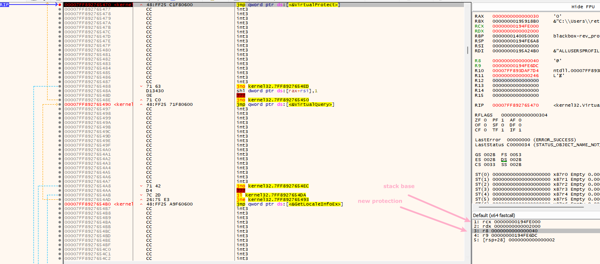
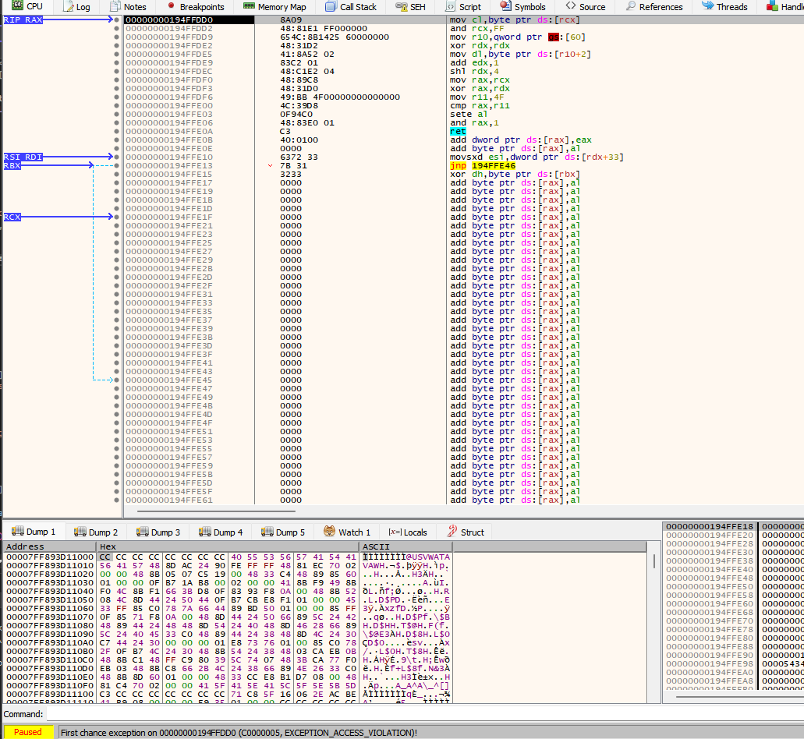
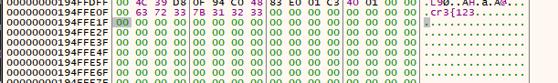
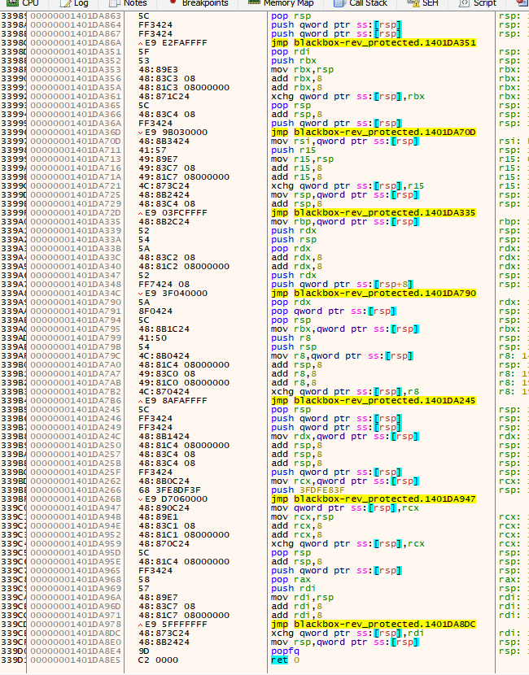
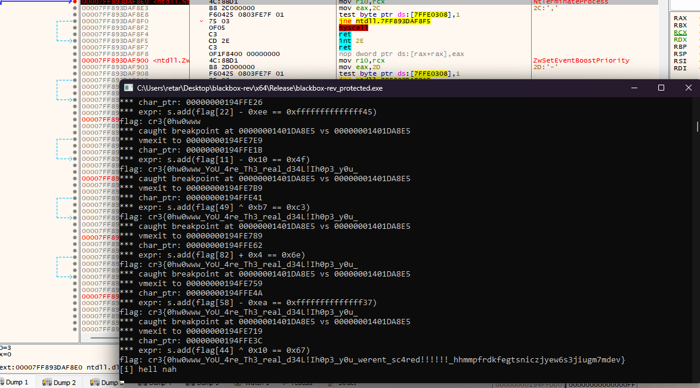

# writeup


## Inspecting binary

First thing first, when we load the provided binary in IDA Pro (or literally any other disassembler/decompiler/etc.), we can see that there is a PE section named `.themida,` which hints to us that this binary is protected with the commercial obfuscator Themida made by Oreans.

Besides the main logic that checks our flag in this program, there are a couple of hints that it prints for us right in the console:
```
[*] reprotecting stack through VirtualQuery&VirtualProtect...
...
[i] hint: can you figure what am i calling?
```

Considering that we need to find what this program is calling and that it is reprotecting the stack using the `VirtualQuery` and `VirtualProtect` winapi functions, we can place a breakpoint for these functions.

After the `VirtualProtect` breakpoint would be hit, we can see that it is reprotecting stack with new protection set to the `PAGE_EXECUTE_READWRITE`.



It is somewhat unusual for a program to change its stack protection to the `PAGE_EXECUTE_READWRITE,` usually, the protection would be set to `PAGE_READWRITE` *(+g)*.

Knowing that we need to find what this program is calling, we can try to intercept the VirtualProtect call so that that stack protection won't be changed to `PAGE_EXECUTE_READWRITE` and let the program execute.

And to our surprise, it really tried to execute something that is located on the stack.



The shellcode that we are looking at is as follows:
```x86asm
mov cl,byte ptr ds:[rcx]  
and rcx,FF                
mov r10,qword ptr gs:[60] 
xor rdx,RDX               
mov dl,byte ptr ds:[r10+2]
add edx,1                 
shl rdx,4                 
mov rax,rcx               
xor rax,RDX               
mov r11,4F                
cmp rax,r11               
sete al                   
and rax,1                 
ret
```

First of all, it loads some bytes from the `rcx` register; let's take a look at what's located there.



Now, we can guess that rcx points to the current character within the flag that the program should check.

Moving on, then it loads the [PEB](https://www.geoffchappell.com/studies/windows/km/ntoskrnl/inc/api/pebteb/peb/index.htm) base address to `r10` and loads the `BeingDebugged` bool from there.

After that, the program adds 1 to this value, shifts it to the left, and compares it with some value.

This shellcode definitely looks like something that compares a character and returns if it matches the one that the program wants or not.

## Tracing VM

Now that we know "how" this program checks our flag, we can start coding a solver for it.

First of all, we need to find a place where themida exits its VM using the VM exit handler and jumps to the shellcode. To do that, we can do the same thing as we did to find this shellcode, but instead of just pressing continue, we would start a tracing session within x64dbg and see what was the last instruction that it hit before jumping to the shellcode.

The plan here is to trace the program execution flow until the exception `ACCESS_VIOLATION` is hit. This could take some time since themida's vmhandlers *are a bit* obfuscated.

Once the exception would be hit, we can finally observe themida's vmexit logic.



Let's grab this `ret 0` instruction rva(`0x1DA8E5`), place a breakpoint there, and log where it exits.

Here are a few exit points for the virtual machine:

Some internal themida stuff:
```x86asm
0000000140094AE0        | E9 2F762F00                        | jmp blackbox-rev_protected.14038C114                                                |
```

GetCurrentThread:
```x86asm
00007FF892760D90 <kernel3 | 48:C7C0 FEFFFFFF                   | mov rax,FFFFFFFFFFFFFFFE                      |
```

OpenThreadToken:
```x86asm
00007FF89379B230 <advapi3 | 48:FF25 E9180700                   | jmp qword ptr ds:[<&OpenThreadToken>]         |
```

GetCurrentProcess:
```x86asm
00007FF892770160 <kernel3 | FF25 6A4F0600                      | jmp qword ptr ds:[<&GetCurrentProcess>]       |
```

OpenProcessToken:
```x86asm
00007FF89379ABA0 <advapi3 | 48:FF25 691F0700                   | jmp qword ptr ds:[<&OpenProcessToken>]        |
```

AllocateAndInitializeSid:
```x86asm
00007FF89379A880 <advapi3 | 48:FF25 31280700                   | jmp qword ptr ds:[<&AllocateAndInitializeSid> |
```

FreeSid:
```x86asm
00007FF89379B610 <advapi3 | 48:FF25 89190700                   | jmp qword ptr ds:[<&FreeSid>]                 |
```

VirtualFree:
```x86asm
00007FF8927647D0 <kernel3 | 48:FF25 69050700                   | jmp qword ptr ds:[<&VirtualFree>]             |
```

IsUserAnAdmin:
```x86asm
00007FF892BE7F20 <shell32 | BA 20020000                        | mov edx,220                                   |
```

VirtualProtect(the one that themida calls by itself):
```x86asm
00007FF892765470 <kernel3 | 48:FF25 C1F80600                   | jmp qword ptr ds:[<&VirtualProtect>]          |
```

RtlRemoveVectoredExceptionHandler:
```x86asm
00007FF893D955A0 <ntdll.R | 33D2                               | xor edx,edx                                   |
```

Shellcode 1:
```x86asm
00000000194FFDD0          | 8A09                               | mov cl,byte ptr ds:[rcx]                      |
00000000194FFDD2          | 48:81E1 FF000000                   | and rcx,FF                                    |
00000000194FFDD9          | 654C:8B1425 60000000               | mov r10,qword ptr gs:[60]                     |
00000000194FFDE2          | 48:31D2                            | xor rdx,rdx                                   |
00000000194FFDE5          | 41:8A52 02                         | mov dl,byte ptr ds:[r10+2]                    |
00000000194FFDE9          | 83C2 01                            | add edx,1                                     |
00000000194FFDEC          | 48:C1E2 04                         | shl rdx,4                                     |
00000000194FFDF0          | 48:89C8                            | mov rax,rcx                                   |
00000000194FFDF3          | 48:31D0                            | xor rax,rdx                                   |
00000000194FFDF6          | 49:BB 4F00000000000000             | mov r11,4F                                    | 4F:'O'
00000000194FFE00          | 4C:39D8                            | cmp rax,r11                                   |
00000000194FFE03          | 0F94C0                             | sete al                                       |
00000000194FFE06          | 48:83E0 01                         | and rax,1                                     |
00000000194FFE0A          | C3                                 | ret                                           |
```

Shellcode 2:
```x86asm
00000000194FFD90          | 8A09                               | mov cl,byte ptr ds:[rcx]                      |
00000000194FFD92          | 48:81E1 FF000000                   | and rcx,FF                                    |
00000000194FFD99          | 654C:8B1425 60000000               | mov r10,qword ptr gs:[60]                     |
00000000194FFDA2          | 48:31D2                            | xor rdx,rdx                                   |
00000000194FFDA5          | 41:8A52 02                         | mov dl,byte ptr ds:[r10+2]                    |
00000000194FFDA9          | 83C2 01                            | add edx,1                                     |
00000000194FFDAC          | 48:C1E2 04                         | shl rdx,4                                     |
00000000194FFDB0          | 48:89C8                            | mov rax,rcx                                   |
00000000194FFDB3          | 48:29D0                            | sub rax,rdx                                   |
00000000194FFDB6          | 49:BB 5B00000000000000             | mov r11,5B                                    | 5B:'['
00000000194FFDC0          | 4C:39D8                            | cmp rax,r11                                   |
00000000194FFDC3          | 0F94C0                             | sete al                                       |
00000000194FFDC6          | 48:83E0 01                         | and rax,1                                     |
00000000194FFDCA          | C3                                 | ret                                           |
```

Shellcode 3:
```x86asm
00000000194FFD60          | 8A09                               | mov cl,byte ptr ds:[rcx]                      |
00000000194FFD62          | 48:81E1 FF000000                   | and rcx,FF                                    |
00000000194FFD69          | 48:BA 7F00000000000000             | mov rdx,7F                                    |
00000000194FFD73          | 48:89C8                            | mov rax,rcx                                   |
00000000194FFD76          | 48:31D0                            | xor rax,rdx                                   |
00000000194FFD79          | 49:BB 1700000000000000             | mov r11,17                                    |
00000000194FFD83          | 4C:39D8                            | cmp rax,r11                                   |
00000000194FFD86          | 0F94C0                             | sete al                                       |
00000000194FFD89          | 48:83E0 01                         | and rax,1                                     |
00000000194FFD8D          | C3                                 | ret                                           |
```

And so on...

By looking at these shellcodes, we can find some similarities in them:
* All of them start with the same `mov cl; and rcx` instructions
* All of them ends with the same `mov r11, imm; cmp rax, r11; sete al; and rax, 1; ret` instructions

Also, all of these shellcodes perform one of the `add, xor, sub` operations.

Some of these shellcodes include anti-debugger checks and doing math operations using the results of these checks.

What we need to do is catch all the shellcodes like this and calculate the char that it checks for. 

## Solving

To catch all the shellcodes like this, instead of placing a `VectoredExceptionHandler` with a breakpoint to this `ret` instruction, we need to hook the `ntdll!RtlDispatchException` function as it is the first function that gets called when an exception occurs.

We cannot use `AddVectoredExceptionHandler` because we have to initialize ourselves before the themida and in the themida's initialization, it would remove all the vehs using the `RtlRemoveVectoredExceptionHandler` function.

The fun thing about the `RtlDispatchException` function is that it is not exported, and we have to find it within the ntdll manually. One of the methods that we can use is just to get the pdb for `ntdll.dll` from ms pdb server and find the function there, then grab the RVA and use it in our code. On my Windows setup, this RVA is `0x1E1E0`.

So, let's start implementing this.

```cpp
void* orig_rtl_dispatch_exc = nullptr;
void rtl_dispatch_exc(PEXCEPTION_RECORD ExceptionRecord, PCONTEXT Context) {
    if (ExceptionRecord->ExceptionCode != EXCEPTION_BREAKPOINT && ExceptionRecord->ExceptionCode != EXCEPTION_SINGLE_STEP) {
        return reinterpret_cast<decltype(&rtl_dispatch_exc)>(orig_rtl_dispatch_exc)(ExceptionRecord, Context);
    }

    if (ExceptionRecord->ExceptionCode == EXCEPTION_SINGLE_STEP) {
        printf("vmexit to %p\n", Context->Rip);
        // restore the breakpoint
        *reinterpret_cast<std::uint8_t*>(g_patch_addr) = 0xCC;
        return;
    }

    DEBUG_LOG("*** caught breakpoint at %p vs %p\n", ExceptionRecord->ExceptionAddress, g_patch_addr);
    // patch it back
    *reinterpret_cast<std::uint8_t*>(ExceptionRecord->ExceptionAddress) = 0xC2;
    Context->EFlags |= 0x100; // activate singlestep
}

BOOL __stdcall DllMain(void*, std::uint32_t call_reason, void*) {
    if (call_reason != DLL_PROCESS_ATTACH) {
       return 1;
    }

    g_base = reinterpret_cast<std::uintptr_t>(GetModuleHandleA(NULL));
    g_patch_addr = g_base + 0x1DA8E5; // offset to the `ret 0` instruction within themida vmexit stub

    MH_Initialize();
    MH_CreateHook((void*)(uintptr_t(GetModuleHandleA("ntdll")) + 0x1E1E0), rtl_dispatch_exc, (void**)&orig_rtl_dispatch_exc); // RtlDispatchException
    MH_EnableHook(nullptr);

    *reinterpret_cast<std::uint8_t*>(g_patch_addr) = 0xCC;

    return 1;
}
```

Then, start the process in the debugger, inject our dll, and let it run. We will see a lot of vmexit logs.

Now, when we have all of the vmexits caught, we can start parsing them and extracting needed stuff.

Let's start with the IM calculation first. We are aware that there are 3 types of imms that this program utilizes.
* Straight imm that gets moved with movabs
* Value of the `BeingDebugged` bool within the `PEB` structure
* Value of the `KdDebuggerEnabled` bool within the `KUSER_SHARED_DATA` structure

We can just compare the first 2 bytes within the stub and calculate the needed imm.
```cpp
std::optional<std::uint64_t> get_imm(std::uint8_t* region) {
    switch (*reinterpret_cast<std::uint16_t*>(region)) {
    case 0xBA48: // mov imm64
        return *reinterpret_cast<std::uint64_t*>(&region[2]);
    case 0x4C65: // peb check
        return 1ULL << 4; // 1 because its doing val + 1
    case 0x3148: // kusd check
        return 1ULL << 4; // 1 because its doing val + 1
    default:
        return std::nullopt;
    }
}

void handle_vmexit(std::uint8_t* ptr, std::int8_t* char_ptr) {
    ptr += 9; // skip mov cl byte ptr [rcx]; and rcx, 0xFF

    const auto imm = get_imm(ptr);

    // other themida trash
    if (!imm.has_value()) {
        return;
    }

    DEBUG_LOG("*** vmexit to %p\n", ptr);
}
```

Then, we want to get the value that it checks the math operation result with.
To do that we need to skip all the instructions that would be executed before `movabs r11, ***` and extract the imm from this instruction.

```cpp
// skip `mov rax, rcx` and all the shit before this insn
for (std::size_t j = 0; true; ++j) {
    if (ptr[j] != 0x48 || ptr[j + 1] != 0x89 || ptr[j + 2] != 0xC8) {
        continue;
    }

    ptr += j + 3;
    break;
}

std::uint64_t expected_value = *reinterpret_cast<std::uint64_t*>(&ptr[5]);
```

Now we know the rhs of the operation, but we don't know the lhs. To find the character index that the shellcode checks, we have to get the `rcx` value and backtrack it until we see the `cr3{` prefix of the flag. Then we should subtract the character ptr with the ptr that we found, and we will obtain the character index.

```cpp
std::int8_t* find_flag_start(std::int8_t* ptr) {
    for (;;) {
        if (ptr[0] != 'c' || ptr[1] != 'r' || ptr[2] != '3') {
            ptr -= 1;
            continue;
        }

        return ptr;
    }

    std::unreachable();
}

/// ...

size_t index = char_ptr - find_flag_start(char_ptr);
```

One thing that is left for us to get the flag is to implement the reverse operations for these math operations.

First, we have to find what operation the shellcode is doing exactly; to do that, we can compare the instruction bytes.

After that, the only thing we have to do is revert the operation from the one that it is supposed to execute.

```cpp
switch (static_cast<operation_t>(ptr[1])) {
case operation_t::ADD:
    flag_value[index] = static_cast<char>(expected_value - *imm);
    DEBUG_LOG("s.add(flag[%lld] + 0x%llx == 0x%llx)\n", index, *imm, expected_value);
    break;
case operation_t::XOR:
    flag_value[index] = static_cast<char>(expected_value ^ *imm);
    DEBUG_LOG("s.add(flag[%lld] ^ 0x%llx == 0x%llx)\n", index, *imm, expected_value);
    break;
case operation_t::SUB:
    flag_value[index] = static_cast<char>(expected_value + *imm);
    DEBUG_LOG("s.add(flag[%lld] - 0x%llx == 0x%llx)\n", index, *imm, expected_value);
    break;
default:
    printf("*** unknown operation!\n");
    break;
}

printf("flag: %s\n", flag_value);
```

And when we execute it, we can finally get the flag printed in the console!



**Full source code of the solver could be found in the same project as the challenge itself in the `challenge` folder**
