Let's take a look at the js scripts we are given:

These files look familiar to what we had in the original `jscripting` call, with the exception that there's some `utils.jsc`, which appears to be a file containing V8 bytecode to be executed by `worker.js`.
```js
const { runBytecodeFile } = require("./bytecode.js")

runBytecodeFile("./utils.jsc")();

const vm = require('vm');
```

Let's try the payload that gave us the flag in the original chall:


```js
return [...module.require('util').inspect(this.storage)]
```

Oops, seems like the `module` object is no longer defined.

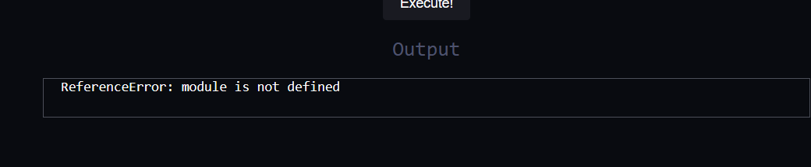

Luckily for us, there is `secureRequire` in the `global` object, let's try it!

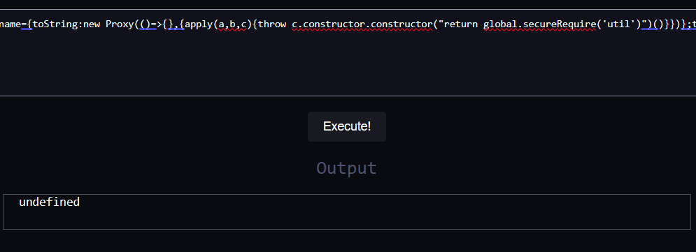

It doesn't seem to work, but where does this `secureRequire` come from?

Let's try to look in `utils.jsc`.

It shows nothing in the text editor, so let's open it with the hex editor

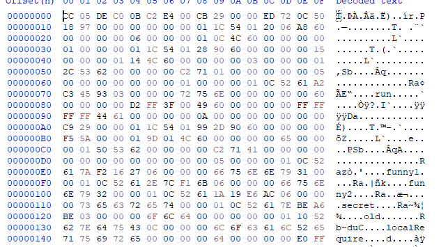

Looking at this file, you might notice some familiar names like `module`, `require` and other (node) js functions.

And it seems that the `secureRequire` function is defined in this file:
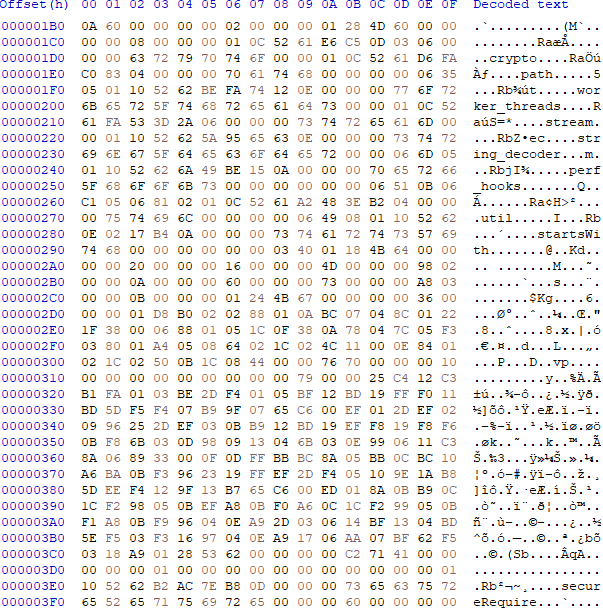

And there's also an odd list of modules: `crypto`, `path`, `worker_threads`, `stream`, `path`, `worker_threads`, `string_decoder`, `perf_hooks`, and especially `util`, but it looks different when separated from the rest of the modules.

So let's try to require modules that are not in this list and then modules that are in the list:

not in the list
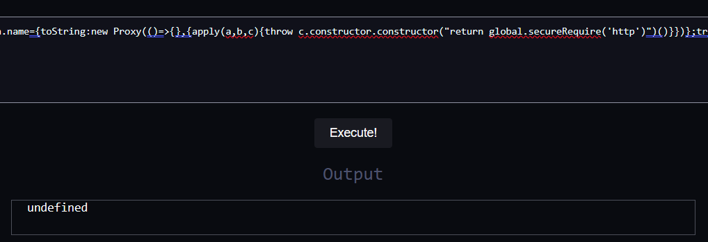

in the list
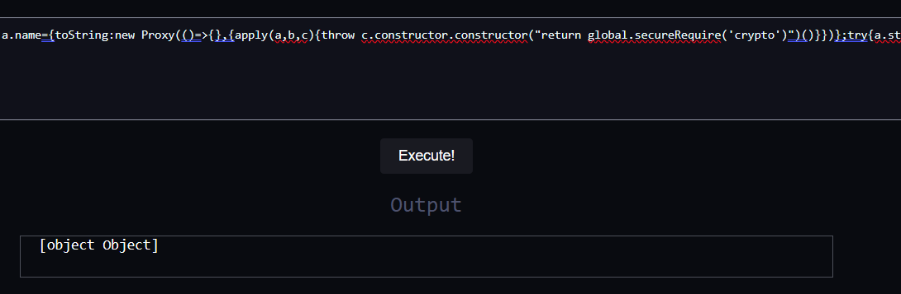

It seems to be some kind of whitelist. So what's wrong with the `util` module?

You may notice the `startsWith` function near the `util` module:
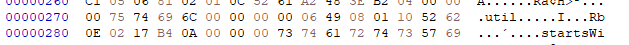

Let's hook and see if it interacts with the `util` string!
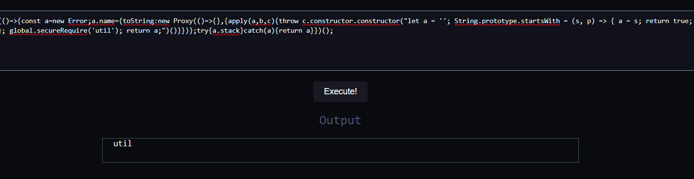

Yes, it seems that it's there to check if `util` is present and we can just make it `return false`.
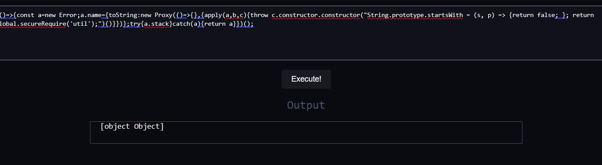

Now that we have access to `util.inspect`, we can call it on `globalThis.storage`:

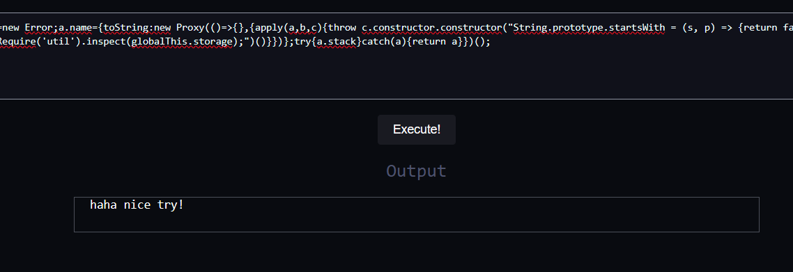
Oops, it seems the `util.inspect` response is being overwritten, let's find out why.

Node.JS documentation says
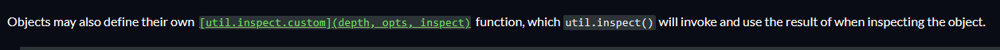

Looking at the documentation page, you may also notice that there is a `customInspect` option in `util.inspect` that calls the standard function instead of the custom one.
 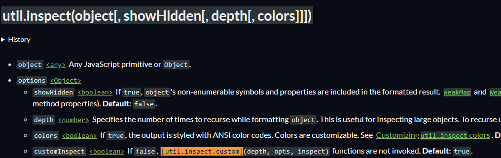

Applying it to the call doesn't return a flag, but another funny message:
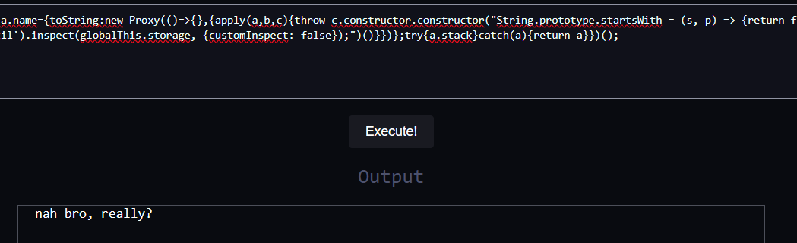

We seem to be on the right track, but what do we do next?

Let's look for these messages in the hex editor:

Looks like there's something to do with the `depth` property of the `inspectOptions` object, let's play with it:

Passing number more than 3 will result in this `Error: Too deep` message and passing a small number would do nothing but give a funny message.

There's also a `parseInt` function used with the `depth` property, probably `depth` value checking:
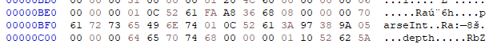

The `parseInt` function is known to return only the significant part of a number when the number passed is too large.

So it seems like we should pass a value greater than 3, but which won't be trimmed by `parseInt`, and that number is... `Infinity`!

Also, Node documentation states that to recurse to the maximum call stack size pass `Infinity` or `null`, so that should be the answer:
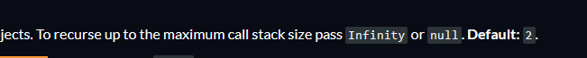

Let's execute code for the last time:
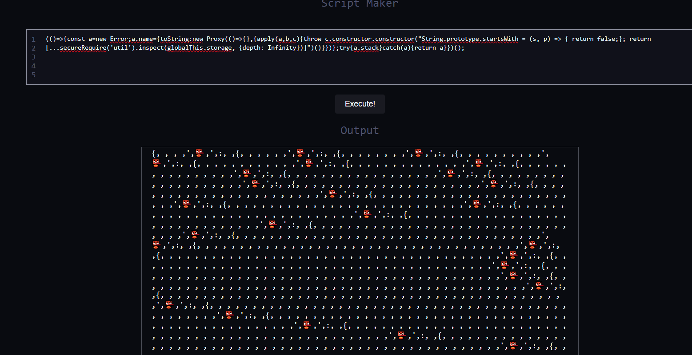

Oh.... that's a very deep object, it's stripped by HTML or something, so you can't just find flag by looking in the HTML code.

But we can find it by looking at the Network tab:
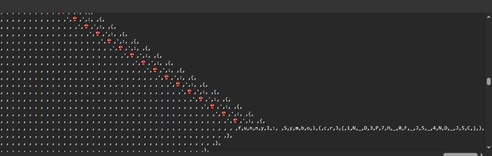

There it is!
The flag is: `cr3{1N_D3P7H_0F_J5_4ND_J5C}` 